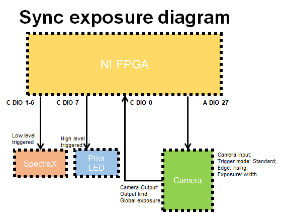
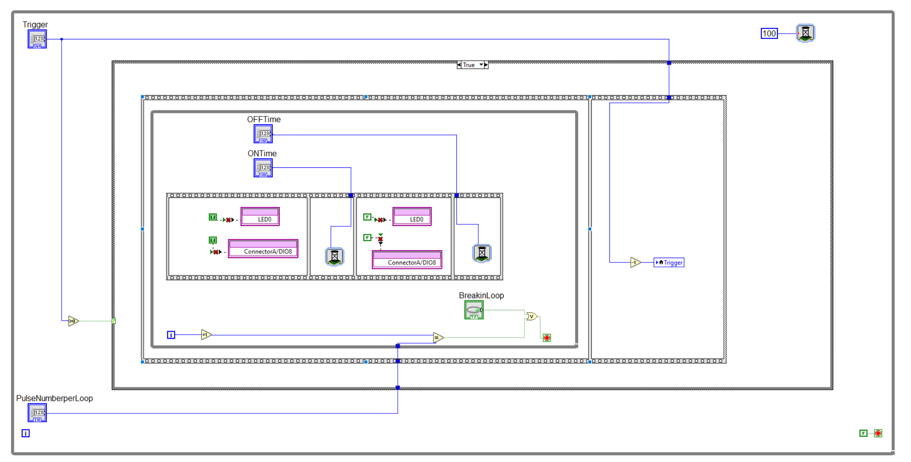
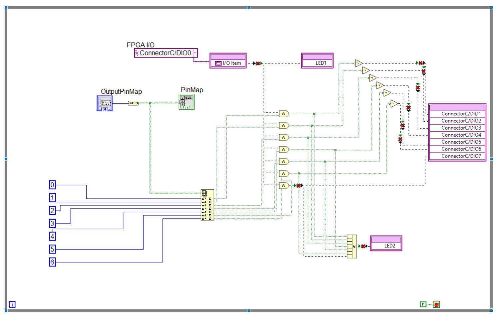

# **pycmm**

This package is used to control the Ti2 microscopes in SIAT. 
The commands for controlling Nikon microscope relay on package `pycromanager`, 
a package of MMCoreJ wrap of python, and some third-party devices which 
have a clear documented SDK was designed python interface for efficiency reasons.

Third-party devices including:
* Prior SDK python interface
* Andor sCMOS camera
* myRIO trigger

## **Device**

### **/device/NI_FPGA**

We use myRIO 19000 as the signal generator. The package `nifpga` is used for communicating myRIO.
Connector A DIO 27 is used for camera trigger signal output.
Connector C DIO 0 is used for receive the camera output.
Connector C DIO 1-7 are usd for triggering the light source, for convenience, 1-6 are used for spectraX, and DIO 7 is used for controlling the prior bright field source.

- Register description

   `PulseNumberperLoop`: int, How much trigger signals (pulse) was trigger with one cycle. When set to `-1`, myRIO will output pulse continuously. \
   `BreakinLoop`: bool, default is `False`, if set `True`, it will disrupt current trigger cycle.\
   `Trigger`: int, default is `0`. It determines the trigger cycle numbers. \
   `OFFTime`: int, Trigger pulse width (high state width) in microsecond.\
   `ONTime`: int, Trigger pulse width (high state width) in microsecond.\
   `OutPutPinMap`: uint8, Connector **C DIO 1-7** are mapped to its bitwise value. i.e., for C:DIO 1 to be ON, when the camera output signal come, needs a decimal value of 1 (B00000001), for all pins to be ON, needs a decimal value 127 (B01111111).
   
   

## Module

###  multi_t_xy_c_acquisiation/PymmAcq

This module used to control the device states and the UI

For live mode, the two methods can be called.

PymmAcq.start_streaming(step)

the `step` set the exposure time of camera.

PymmAcq.stop_streaming()

## **Dependence**

This package needs python packages followed,
> [micromanager](https://pypi.org/project/pycromanager/) \
> pip install pycromanager --upgrade \
> numpy \
> scipy\
> tifffile\
> [nifpga](https://pypi.org/project/nifpga/) \
> pip install nifpga \
> [napari](https://napari.org/) \
> pip install "napari[pyside2]"
> 

## Appendix
   

   